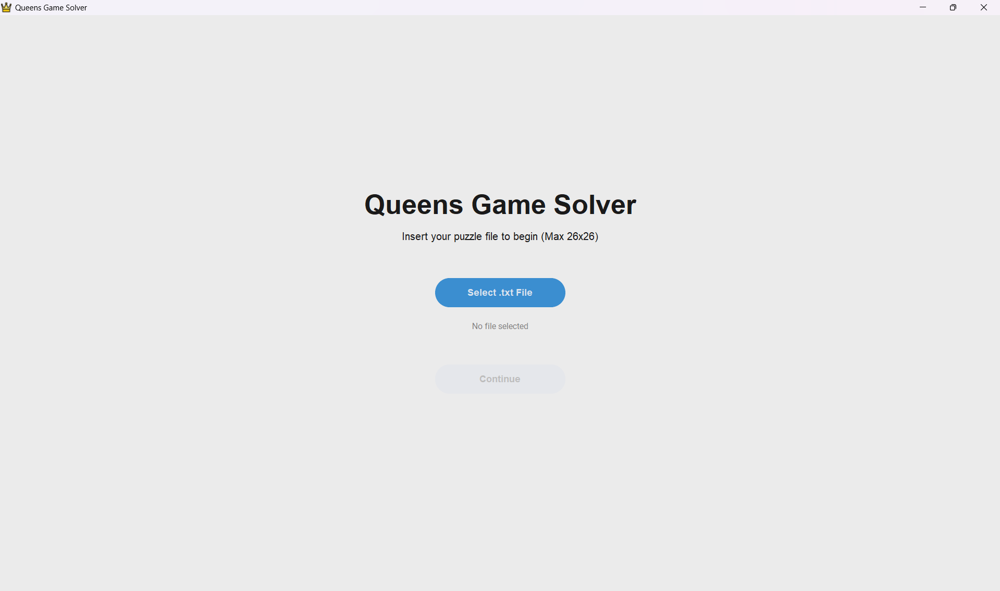
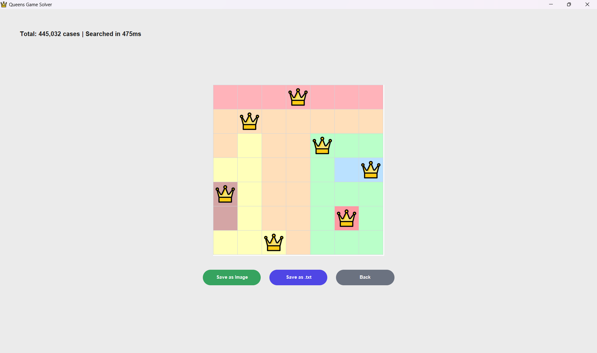

# 👑 Queens Solver 👑

## 📷 Preview

 
 


---

## 📍Overview

Program ini berbasis Graphical User Interface (GUI). Solver ini hanya dapat menerima input berupa file .txt yang berupa board NxN (maksimal 26x26) yang terdiri dari huruf kapital A-Z sebagai representasi wilayah atau warna. Kemudian, program mencari solusi penemparan N queen dengan dua metode, yaitu:
1. Exhaustive Search (Brute Force)
2. Optimization (Pruning/Backtracking)

Aturan bermain:
1. Pemain harus menempatkan n  queen pada papan n × n.
2. Pada setiap baris hanya boleh terdapat tepat 1 (satu) queen.
3. Pada satu kolom hanya boleh terdapat tepat 1 (satu) queen.
4. Dalam satu  warna yang sama tidak boleh terdapat lebih dari satu queen.
5. Queen tidak boleh saling bersentuhan secara diagonal, yang berarti queen pada baris yang berurutan tidak boleh berada di kolom yang sama maupun di kolom yang jaraknya hanya satu posisi.


Hasil solusi dapat berbentuk **Image (.PNG)** 🖼️ dan **File (.txt)** 📂


---

## 👨‍💻 Program Requirement

Program dibuat menggunakan:
- Python 3.13
- Tkinter
- CustomTkinter
- Pillow (PIL)

### Install Depedency 
---
#### Linux / WSL 🐧

```bash
sudo apt update
sudo apt install python3-tk
sudo apt install python3-pil
sudo apt install python3-pil.imagetk
```

#### Windows 🪟
```bash
pip install pillow
pip install customtkinter
```
---
## How to run the program? 🤔

```bash
cd src
python3 main_gui.py
```
### Steps of use
1. Pilih file (.txt) yang berisi board NxN
2. Klik "Continue"
3. Pilih metode penyelesaian
4. Klik "Launch Solver"
5. Hasil akan ditampilkan pada board GUI.
6. Simpan hasil sebagai gambar atau text

---
## Author 👸

Nama: Stefani Angeline Oroh

NIM: 13524064

Program Studi: Teknik Informatika

Universitas: Institut Teknologi Bandung
